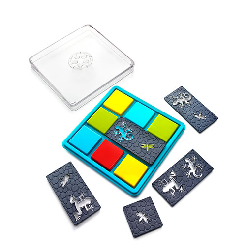
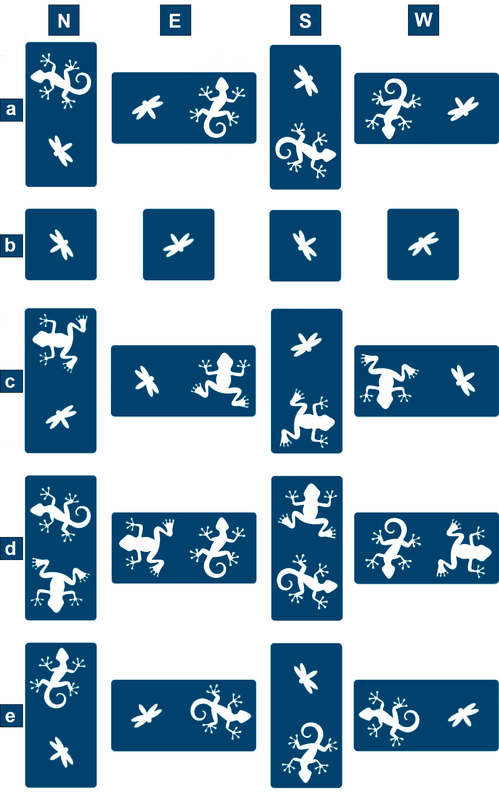
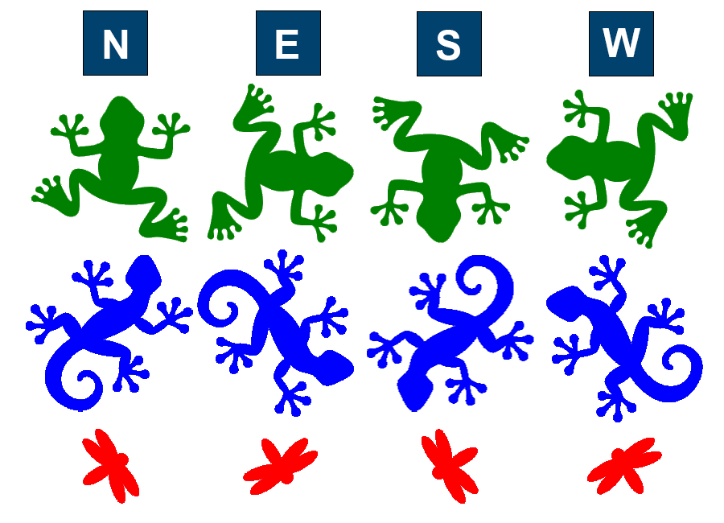
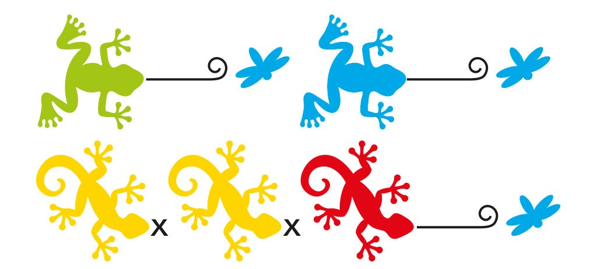
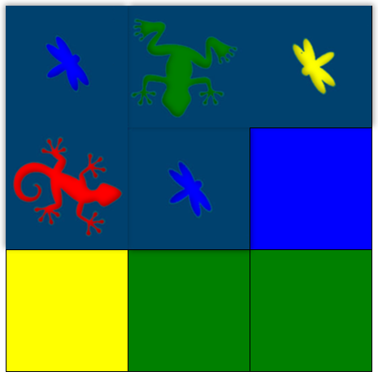
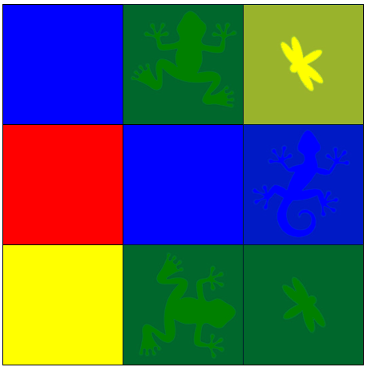
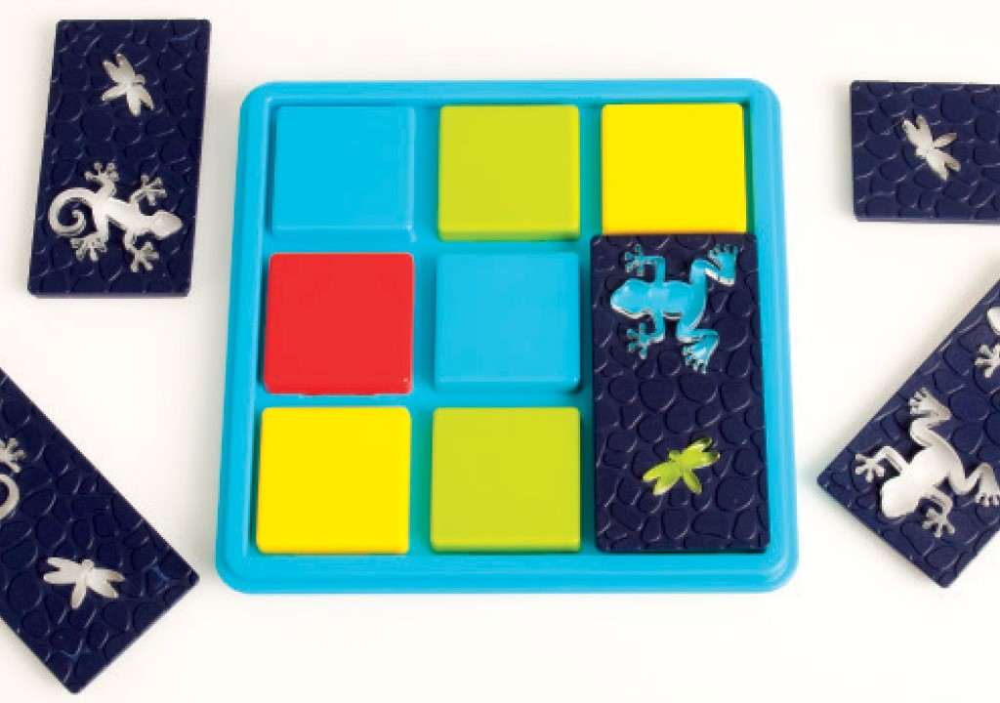
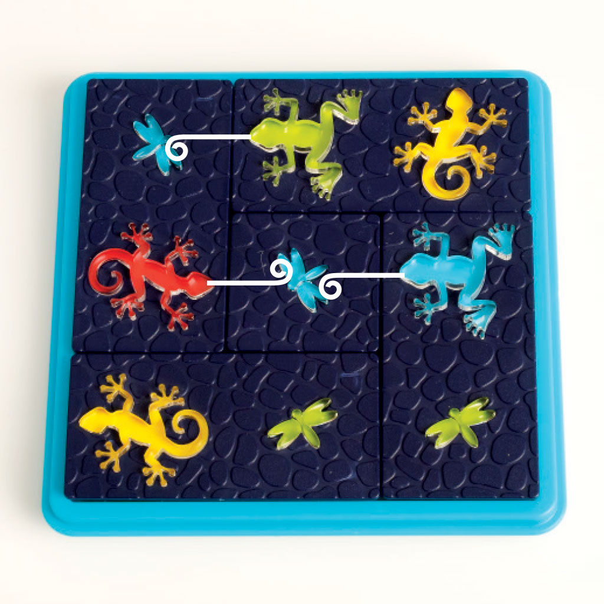

# COMP1110 Assignment 1

## Academic Honesty and Integrity

Honesty and integrity are of utmost importance.
These goals are *not* at odds with being resourceful and working collaboratively. 
You should be resourceful, and you should discuss your work in this course with others taking the class.
The fundamental principle is that **you must never misrepresent the work of others as your own**.

If you have taken ideas from elsewhere or used code sourced from elsewhere, you must say so with *utmost clarity*.
At each stage of the assignment you will be asked to submit a statement of originality, either as a group or as individuals.
This statement is the place for you to declare which ideas or code contained in your submission were sourced from elsewhere.

Please read ANU’s [official position on academic integrity](https://www.anu.edu.au/students/academic-skills/academic-integrity).
If you have any questions, please ask us.

When you do your assignments, carefully review the statement of originality which you must complete. Edit that statement and update it as you complete the assignment, ensuring that when you complete the assignment, a truthful statement is committed and pushed to your repo.

Carefully review the [statement of originality](originality.yml) which you must
complete. Edit that statement and update it as you complete the assignment,
ensuring that when you complete the assignment, a truthful statement is
committed and pushed to your repo.

## Purpose

This assignment is introductory, helping you gain familiarity with the basics
of Java, but doing so in the context of slightly larger piece of code. Most of
the assignment is composed of a series of small tasks.

## Assignment Deliverable

The assignment is worth 5% of your total assessment, and it will be marked out
of 5. However, these marks are [redeemable](https://cs.anu.edu.au/courses/comp1110/assessments/redeemable/) by the exam,
so if your exam mark / 20 is higher than your assignment one mark, you will get the exam mark / 20 rather
than the assignment one mark. **The mark breakdown is described on the
[deliverables](https://cs.anu.edu.au/courses/comp1110/assessments/deliverables/#D1A) page.**

<!-- The assignment is due at **TIME HERE**, **DATE HERE**, giving you **NUMBER OF WEEKS HERE** weeks in which to complete it. -->  
You can find [the deadline](https://cs.anu.edu.au/courses/comp1110/assessments/deliverables/#D1A)
on the [deliverables page](https://cs.anu.edu.au/courses/comp1110/assessments/deliverables/), where all assignment
deadlines for this semester are
listed.
Your tutor will mark your assignment by accessing your GitLab repository, so it is essential that you carefully follow
instructions for setting up and maintaining your repository. You will be marked
according to **whatever is committed to your repository at the time of the deadline**.
Since the first assignment is redeemable, [**late extensions
are not offered and will not be given**](https://comp.anu.edu.au/courses/comp1110/policies/#deadlines). As always,
throughout the course, if
some significant circumstance arises outside of the course that affects your capacity to complete the course, please
carefully follow the
ANU's [extenuating circumstances application process](https://www.anu.edu.au/students/program-administration/assessments-exams/extenuating-circumstances-application).

## Overview

<!-- game pieces, objectives -->
This assignment is based on the puzzle game [Colour Catch](https://www.smartgames.eu/uk/one-player-games/colour-catch)
made by [Smart Games](http://www.smartgames.eu/), a producer of educational games.

The aim of the game is to place all the given tiles on the board in such a way that all the puzzle constraints are
satisfied.

### Tiles

This game consists of 5 tiles that contain a combination of Lizard, Frog or Bug animals. Tile b pictured below takes up
one space on the board, the other tiles take up two spaces.

Each tile has 4 orientations. The orientation of the single bug tile is not relevant, but the orientation of the other
tiles is relevant to the puzzle.

Each animal on a tile has an orientation too, shown below:

Note that the orientation of an animal may be different from the orientation of the tile that it is on! 

### Challenge
Challenges are defined by a set of constraints.
The below constraints says that we require: 
- A green frog eats a blue bug
- A blue frog eats a blue bug
- A yellow lizard doesn't eat any bug
- Another yellow lizard doesn't eat any bug
- A red lizard eats a blue bug. 

An animal eats a bug if it is facing the bug. The orientation of the bug does not matter, and multiple animals can eat the same bug. For example in the board below:
- A red Lizard eats a blue bug
- A green frog eats a blue bug

There may also be additional constraints. The challenge may specify certain locations on the board that must contain an Animal in a particular location and orientation. Note that the orientation of the single bug tile does not matter and as such it is still a solution even if that tile doesn't line up with the orientation depicted in the challenge. 
We call this part of the challenge the "Target board".

Challenges are broken down into 4 difficulty levels. 

- Difficulty 0: "Starter", challenges 1-12. These challenges have a target board.
- Difficulty 1: "Junior", challenges 13-28 
- Difficulty 2: "Expert", challenges 29-44
- Difficulty 3: "Master", challenges 45-60

Only difficulty 0 challenges have a target board. 

## Rules

<!-- rules of the game -->
To complete a challenge, each tile must be on the board and each constraint must be satisfied. Tiles may not overlap each other.

1. Select a challenge

   

2. Place all tiles on the board so that the colours of the animals in the constraints are satisfied. 

   

3. There is only one solution. Check that all constraints are satisfied! 

   

## Encoding the Game
<!-- any string/object encoding of game elements that should be explained -->

### Locations
In our game we encode Location in row-major order. For example "02" corresponds to Row 0, Column 2 (0,2) and could 
also be referred to by integer 2. 

It is also useful (for storing the game state) to encode these positions as indices: an integer from 0 to 8 as follows:

|           | **Col 0** | **Col 1** | **Col 2** |
|-----------|-----------|-----------|-----------|
| **Row 0** | 0         | 1         | 2         | 
| **Row 1** | 3         | 4         | 5         |
| **Row 2** | 6         | 7         | 8         |

Notice that most of the tiles in the game occupy more than one space on the board. When talking about the Location of a Tile, we are referring to the top-left square of the tile. 
For example, if Tile a is in the North orientation and covering locations 0 and 3, we would say that the Location of Tile a is (0,0). 
If Tile c was in the East orientation and covering Locations 6 and 7, we would say that the Location of Tile c is (2,0). 

### Challenge Encoding
The initial state of the game is encoded as a string that represents the Constraints and position of animals on the target board (if any). You will not be operating directly with the strings, but it is useful to understand how they are constructed.

#### Target board:

The target board is a string that encodes the animal types, orientations and locations.
It is built up of a number of 3-character substrings that represent a particular animal, orientation and location on the board. 

In a 3-character substring;
- The first character represents the Animal type
- The second character represents the Orientation of the Animal
- The third character represents the integer Location of the Animal

Animal type characters:
- **F** - Frog
- **B** - Bug
- **L** - Lizard

Animal orientation characters:
- **n** - North
- **e** - East
- **s** - South
- **w** - West
- **x** - None

Location:
A single integer between 0 and 8 inclusive

For example:
- `"Fn1"` tells us that there is a Frog, facing North at Location 1.
- `"Lw0"` tells us there is a Lizard facing West at Location 0.
- `"Bs5"` tells us there is a Bug at facing South at Location 5.

In the image below, the target board is: 
`"Fn1Bs2Ln5Fe7Bn8"`
The target board string is always in ascending order of Location.

#### Constraints
A challenge always contains constraints. This single string is also made up of 3-character substrings.

In a 3-character substring:
- The first character represents the Animal type
- The second character represents the Colour of the Animal
- The third character represents the Colour of the Bug that the Animal eats. 

Animal type characters:
- **F** - Frog
- **B** - Bug
- **L** - Lizard

Colour characters:
- **r** - Red
- **b** - Blue
- **g** - Green
- **y** - Yellow
- **x** - None
 
For example: 

- `"Fgb"` tells us that a Green Frog eats a Blue Bug. 
- `"Lyx"` tells us that a Yellow Lizard does *not* eat a Bug.

The constraint string for the example below is: `"FgbFbbLyxLyxLrb"`

#### Solution Encoding
We also encode a solution a set of tile placements. These are 4-character substrings, ordered by tile ID. All 
characters are case-sensitive.

- The first character is the Tile ID: `A` to `E`.
- The second character is the Orientation of the tile `n`, `s`, `e`, or `w` as defined above.
- The third character is the row of the Location of the tile. `0`, `1`, or `2`.
- The fourth character is the column of the Location of the tile. `0`, `1`, or `2`.

For example the solution string for the game below is: `"As00Bx11Cn12De01Ew20"`

Note that because the orientation of Tile `b` is arbitrary, we give it the orientation `x` representing None. Any orientation of Tile `b` will satisfy the challenge even if the target board for a challenge has a specific orientation shown.

## Your Task

Unfortunately your version of the assignment has some missing code.
While the graphical user interface is complete, some of the important
logic is missing, so it won't work as described above. It is your job
to fix the problems, each identified by a FIXME comment in the
source code, so that the code works. Do not change the code except by
following each of the assigned tasks. When those tasks are completed,
the game will function correctly. Check your changes by using the
provided unit tests.

## Legal and Ethical Issues

First, as with any work you do, you must abide by the principles of
[honesty and integrity](https://comp.anu.edu.au/courses/comp1110/policies/#academic-integrity).
We expect you to demonstrate honesty and integrity in everything you do.

In addition to those ground rules, you are to follow the rules one
would normally be subject to in a commercial setting. In particular,
you may make use of the works of others under two fundamental
conditions: a) your use of their work must be clearly acknowledged,
and b) your use of their work must be legal (for example, consistent
with any copyright and licensing that applies to the given material).
**Please understand that violation of these rules is a very serious
offence**. However, as long as you abide by these rules, you are
explicitly invited to conduct research and make use of a variety of
sources. You are also given an explicit means with which to declare
your use of other sources (via originality statements you must
complete). It is important to realize that you will be assessed on the
basis of your original contributions to the project. While you won't
be penalized for correctly attributed use of others' ideas, the work
of others will not be considered as part of your
contribution. Therefore, these rules allow you to copy another
student's work entirely if: a) they gave you permission to do so, and
b) you acknowledged that you had done so. Notice, however, that if you
were to do this you would have no original contribution and so would
receive no marks for the assignment (but you would not have broken any
rules either).

## Evaluation Criteria

**The mark breakdown is described on the
[deliverables](https://cs.anu.edu.au/courses/comp1110/assessments/deliverables/#D1A) page.**
The task numbers/gitlab issues are associated with the following difficulty levels:

**Easy**
- Tasks #1, #2, #3, #4, #5, #6

**Moderate**
- Tasks #7, #8, #9, #10

**Challenging**
- Tasks #11, #12, #13

**IMPORTANT NOTE:** *It is very important that you understand that you are*
**not** *required to complete all elements of the assignment. In fact, **you
are not encouraged to pursue the Challenging tasks unless
you feel motivated and able to do so**. Recall that the assignment is
redeemable against the exam. The last part of the assignment are significantly
harder than the others, but is worth only one additional mark. We do not
encourage you to spend too much time on this unless you are enjoying the
challenge of solving these harder problems. Solutions to tasks #12 and #13 involve
ideas that we have **not covered deeply** in class; you may need
to go beyond the course material.

